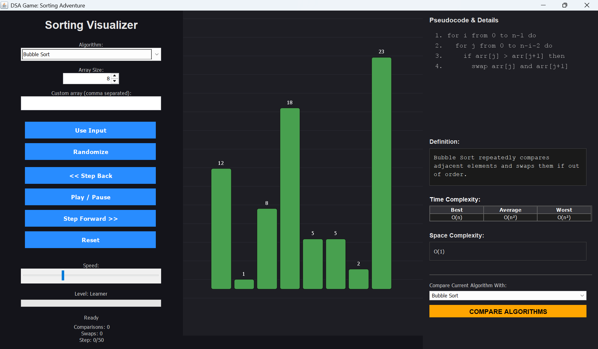

# 🚀 DSA Game: Sorting Adventure

**Sorting Adventure** is an interactive Java Swing application designed to visualize how sorting algorithms work. It features step-by-step visualization, real-time pseudocode tracking, time complexity analysis, and auditory feedback (sonification) to make learning algorithms intuitive and fun.



## ✨ Features

* **📊 Algorithm Visualization:** Watch 8 different algorithms sort arrays in real-time.
    * Bubble, Insertion, Selection, Merge, Quick, Heap, Shell, and Counting Sort.
* **🎵 Auditory Feedback (Sonification):** Hear the sorting!
    * Pitch changes based on value.
    * Comparisons and Swaps have distinct sounds.
    * Satisfying "Success Sweep" sound when finished.
* **🎮 Interactive Controls:**
    * **Play/Pause:** `Spacebar` or on-screen button.
    * **Step-by-Step:** `Left Arrow` / `Right Arrow` for precise analysis.
    * **Speed Control:** Slider to adjust sorting speed.
* **📝 Educational Context:**
    * Displays **Pseudocode** highlighting the exact line being executed.
    * Shows **Time & Space Complexity** (Best, Average, Worst).
    * **Comparison Mode:** Compare the current algorithm against others in a detailed table.
* **🛠 Custom Inputs:** Randomize arrays or input your own comma-separated numbers.

## 📂 Project Structure

This project follows the **MVC (Model-View-Controller)** architectural pattern:

```text
SortingAdventure/
├── src/
│   ├── Main.java                  # Entry Point
│   ├── model/                     # Data logic (Step, SortingAlgorithm interface)
│   ├── view/ (or ui/)             # UI Components (VisualizerPanel, PseudocodePanel)
│   ├── controller/                # Logic (PlaybackController)
│   ├── algorithms/                # Sorting Implementations (Bubble, Quick, etc.)
│   └── utils/                     # Helpers (SoundManager)
└── README.md

⚙️ PrerequisitesTo run this project, you need:Java Development Kit (JDK): Version 14 or higher (Required for modern switch expressions).Type java -version in your terminal to check.Visual Studio Code (Optional, but recommended) with the Extension Pack for Java.🚀 How to RunOption 1: via VS Code (Recommended)Open the SortingAdventure folder in VS Code.Navigate to src/Main.java.Click the Run (Play) button in the top right corner.Option 2: via Terminal / Command LineNavigate to the src folder and compile all packages:Bash# 1. Navigate to source folder
cd src

# 2. Compile all files
javac Main.java algorithms/*.java controller/*.java model/*.java ui/*.java utils/*.java

# 3. Run the application
java Main
🎮 Keyboard Shortcuts
Key               Action
Spacebar          Toggle Play / Pause
Right Arrow (→)   Step Forward
Left Arrow (←)    Step Backward

🧠 Algorithms ImplementedBubble Sort: Simple comparison-based sorting.Insertion Sort: Builds the sorted array one item at a time.Selection Sort: Repeatedly finds the minimum element.Merge Sort: Divide and conquer algorithm (O(n log n)).Quick Sort: Partition-based sorting (Advanced).Heap Sort: Uses a binary heap data structure.Shell Sort: Generalized version of insertion sort.Counting Sort: Integer sorting algorithm (Non-comparison based).

🤝 ContributingFeel free to fork this project and submit pull requests. Suggestions for new features (like Pathfinding visualizations) are welcome!

📜 LicenseThis project is open-source and available for educational purposes.